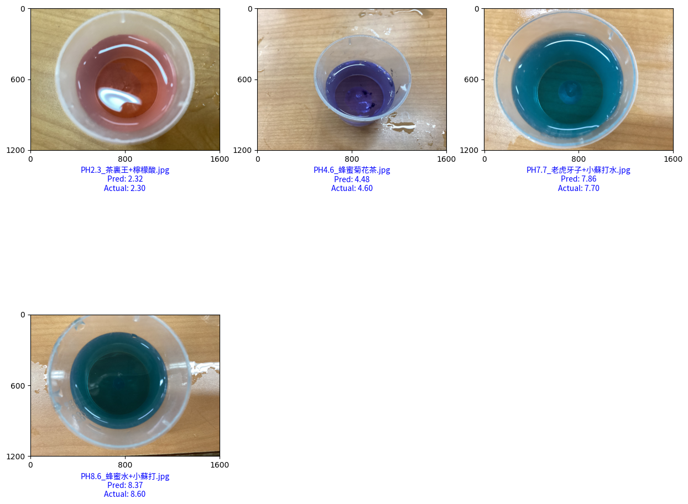

# 📌 使用蝶豆花偵測 PH【 值預測專案

本專案使用 **深度學習 (Deep Learning)** 來 **分析蝶豆花水的顏色，預測 PH 值**。  
透過 **TensorFlow + Keras** 訓練模型，並支援 **MobileNet、EfficientNetV2** 及 **客製化 CNN**，適用於小型資料集。

---

## 📂 **專案目錄結構**
```
📦 MyFolder
│── 📂 dataset/             # 存放原始圖片數據集
│── 📂 pred_imgs/           # 存放要預測的圖片
│── 📂 results/             # 訓練 & 預測結果
│   │── 📂 20250315_023225/  # 訓練結果資料夾
│   │── 📂 20250315_030140/  # 另一批訓練結果
│── 📂 models/              # 包含不同 CNN 模型
│── 📂 utils/               # 工具類（數據處理、視覺化、Markdown 生成等）
│── .devcontainer/          # VSCode Dev Container 設定
│── config.py               # 設定檔
│── train.py                # 啟動訓練
│── pred.py                 # 執行預測
│── README.md               # 本文件
```

**核心程式說明：**
- `train.py`：執行 **AI 訓練**，產生最佳模型 (`.h5`)
- `pred.py`：使用訓練好的模型，對新圖片進行 **PH 值預測**
- `config.py`：設定超參數，如 `batch_size`, `epochs`, `learning_rate`
- `models/models.py`：建立 **CNN (卷積神經網路) 模型**
- `utils/dataset_manager.py`：處理 **數據集**，切分 **訓練 / 驗證** 資料
- `utils/plotter.py`：繪製 **Loss & MAE 圖表**，視覺化 AI 訓練結果

---

## ⚙️ **設定**

### **使用 `init.sh`初始化專案**

### **設定 `config.py`**
**開啟 `config.py`，可以設定訓練參數：**
```python
# 選擇模型
MODEL_TYPE = "MobileNetV2"  # 可選 "MobileNet", "EfficientNetV2", "CustomCNN"

# 訓練參數
BATCH_SIZE = 32
EPOCHS = 80
LEARNING_RATE = 0.0005
```

### **準備數據集**
請將**蝶豆花水顏色的圖片**放入 `dataset/` 目錄，每張圖片檔名須包含 PH 值，例如：
```
dataset/
│── PH3.2_蝶豆花水_淡紫.jpg
│── PH5.8_蝶豆花水_藍色.jpg
│── PH8.6_蝶豆花水_綠色.jpg
```
> 📌 **AI 會自動從檔名擷取 PH 值，不需要額外標註資料集！**

---

## 🚀 **如何使用**
### **1️⃣ 啟動訓練**
運行 `train.py` 開始訓練：
```bash
python train.py
```
- 訓練完成後，模型權重會保存在 `results/YYYYMMDD_HHMMSS/weights/`
- 訓練的 Loss & MAE 變化圖會存入 `trainings/`
- 產生訓練報告 `summary.md`

> 📌 **可在 `config.py` 更改訓練參數，如 batch_size、epochs 等**

---

### **2️⃣ 進行預測**
將要預測的圖片放入 `pred_imgs/`，然後執行：
```bash
python pred.py results/YYYYMMDD_HHMMSS/
```
- **預測結果會存入 `predictions/`**
- **輸出 `predictions/summary.md`，記錄平均誤差與最佳模型**

---

## **🔬 AI 訓練流程**
1️⃣ **準備數據集**  
   - 從 `dataset/` 讀取圖片，擷取 **檔名中的 PH 值** (e.g., `PH3.5_檸檬茶.jpg` → PH 3.5)  
   - 產生 `ph_dataset.csv`，記錄每張圖片對應的 **PH 值**  
   - 使用 `ImageDataGenerator` **增強圖片** (調整亮度、翻轉)  

2️⃣ **建立 AI 模型**  
   - 預設使用 **MobileNetV2**，但也可選擇 **EfficientNetV2B0** 或 **自訂 CNN(我稱為 `MineLiteModelV1`)**  
   - 模型輸出 **單一數值 (PH 值)**，採用 **回歸 (Regression)**
   
3️⃣ **開始訓練**  
   - 使用 **MSE (均方誤差)** 作為 Loss Function  
   - 設定 **學習率調整 (ReduceLROnPlateau)**，避免過擬合  
   - 每個 epoch 訓練後，儲存最佳 **模型 (`.h5`)**  

4️⃣ **測試模型**  
   - 訓練完成後，自動選擇 **最佳模型**，執行 `pred.py` 進行測試  
   - 繪製 **預測結果圖** (`pred_run1.png`)，顯示 **實際 PH 值 vs AI 預測 PH 值**  

---

## **🛠 重要程式碼解析**
### **📌 (A) 使用 MobileNet 訓練**
```python
from tensorflow.keras.applications import MobileNet
from tensorflow.keras.models import Model
from tensorflow.keras.layers import Flatten, Dense

def build_mobilenet():
    """ 建立 MobileNet 模型 """
    base_model = MobileNet(input_shape=(224, 224, 3), alpha=1.0, weights='imagenet', include_top=False)
    x = base_model.output
    x = GlobalAveragePooling2D()(x)
    x = Dense(128, activation="relu")(x)
    x = Dense(64, activation="relu")(x)
    output = Dense(1, activation='linear', name='ph_value')(x)

    model = Model(inputs=base_model.input, outputs=output)
    model.compile(optimizer="adam", loss="mean_squared_error", metrics=["mae"])
    return model
```

📌 **MobileNet 的特點**
- **輕量級 CNN 模型**，適合小型數據集
- 使用 **ImageNet 預訓練權重**，加快訓練速度
- **`Dense(1)` 使用 `linear`**，表示回歸 (Regression)

---

### **📌 (B) 自訂 CNN (Custom CNN)**
```python
from tensorflow.keras.models import Sequential
from tensorflow.keras.layers import Conv2D, MaxPooling2D, Flatten, Dense, Dropout

def build_lightweight_cnn():
    model = Sequential([
        Conv2D(32, (3, 3), activation="relu", input_shape=(224, 224, 3)),
        MaxPooling2D((2, 2)),

        Conv2D(64, (3, 3), activation="relu"),
        MaxPooling2D((2, 2)),

        Flatten(),
        Dense(128, activation="relu"),
        Dropout(0.5),
        Dense(1, activation="linear")  # 回歸預測 PH 值
    ])
    return model
```

📌 **自訂 CNN 的特點**
- **適合小數據集**，較 MobileNetV2 簡單
- **兩層卷積 + 最大池化 (MaxPooling)**
- **Dropout 層**，降低過擬合
- **最終輸出層為 `Dense(1, activation="linear")`**，適用回歸任務

---

### **📌 數據處理 (`utils/dataset_manager.py`)**
```python
from tensorflow.keras.preprocessing.image import ImageDataGenerator

def create_generator(dataframe, shuffle):
    data_gen = ImageDataGenerator(
            rescale=1.0 / 255,
            rotation_range=15,        # ✅ 隨機旋轉 15 度
            width_shift_range=0.1,    # ✅ 隨機水平平移 10%
            height_shift_range=0.1,   # ✅ 隨機垂直平移 10%
            zoom_range=0.2,           # ✅ 隨機縮放 20%
            horizontal_flip=True      # ✅ 隨機水平翻轉
        )
```

---

## **📊 AI 訓練結果**

🧠 **使用模型**: `MineLiteModelV1` (自定義的模型)
⏳ **總訓練時間**: 00:17:27
🔄 **訓練批次**: 5 次

### 📊 資料集資訊
- **訓練集樣本數**: `136`
- **驗證集樣本數**: `15`

### 訓練結果
- **Run 1**: `val_loss = 0.2366`, `val_mae = 0.3959`, ⏱ **訓練時長**: 00:03:33
- **Run 2**: `val_loss = 0.1664`, `val_mae = 0.3698`, ⏱ **訓練時長**: 00:03:24
- **Run 3**: `val_loss = 0.2271`, `val_mae = 0.4008`, ⏱ **訓練時長**: 00:03:27
- **Run 4**: `val_loss = 0.1509`, `val_mae = 0.3153`, ⏱ **訓練時長**: 00:03:34
- **Run 5**: `val_loss = 0.1679`, `val_mae = 0.2923`, ⏱ **訓練時長**: 00:03:26

### 最佳模型
🏆 **最佳模型**: `results/20250315_023225/weights/best_ph_model_run4.h5`
📉 **最低驗證 Loss**: `0.1509`
📊 **最低驗證 MAE**: `0.3153`

### 訓練超參數
- **Batch Size**: `32`
- **Epochs**: `100`
- **Learning Rate**: `0.001`

### 預測結果
- **🏆 最佳模型**: `results/20250315_023225/weights/best_ph_model_run1.h5`
- **📊 最低 平均誤差**: `0.1350`


---

## **📌 總結**
- **我們使用 CNN 讓 AI 學習 PH 值與顏色的關係**
- **AI 透過 MobileNetV2 預測 PH 值，誤差約 ±1.5**
- **未來可以增加數據量，提升 AI 的準確度**
